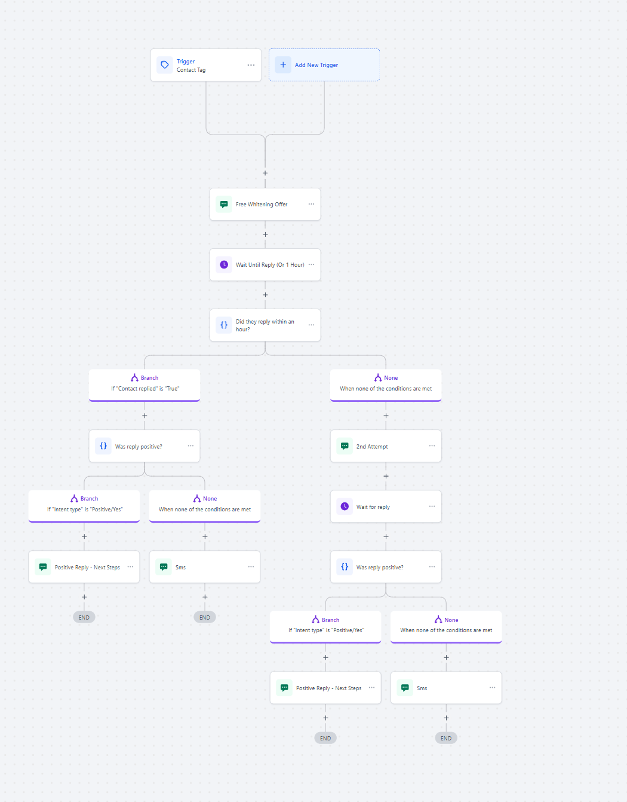
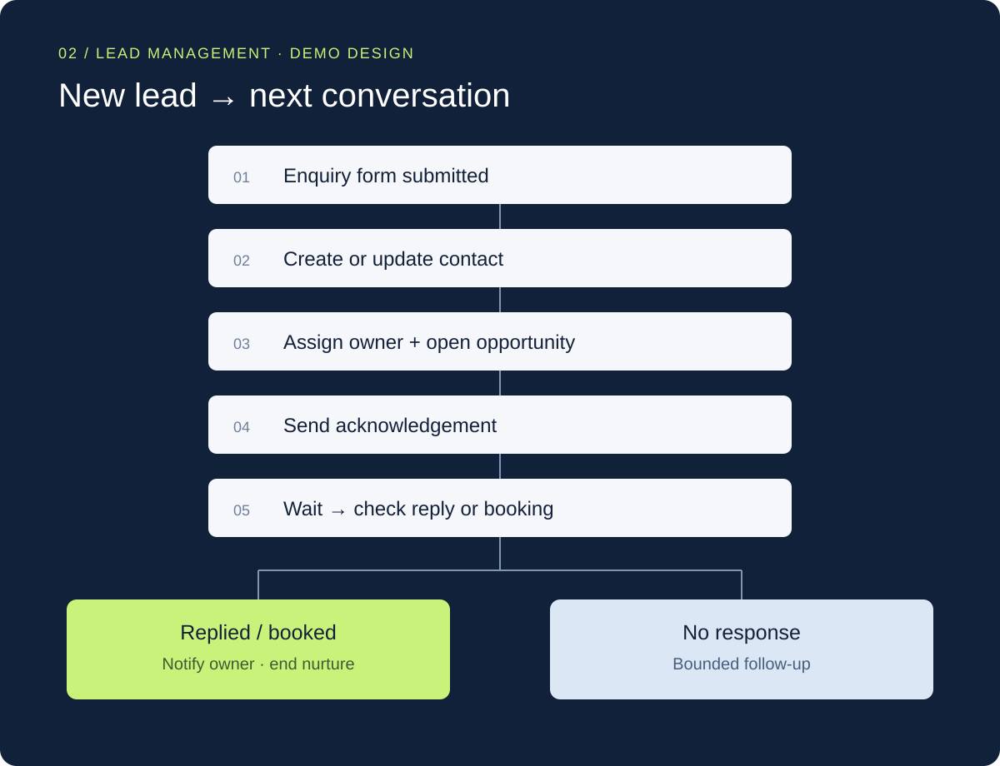
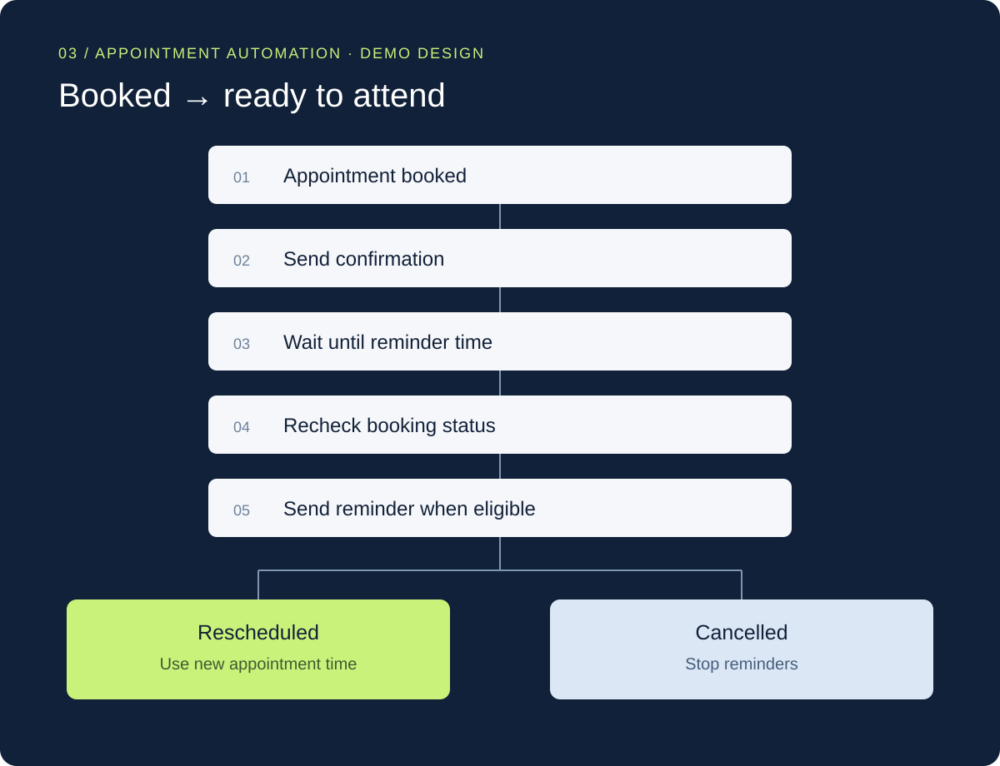
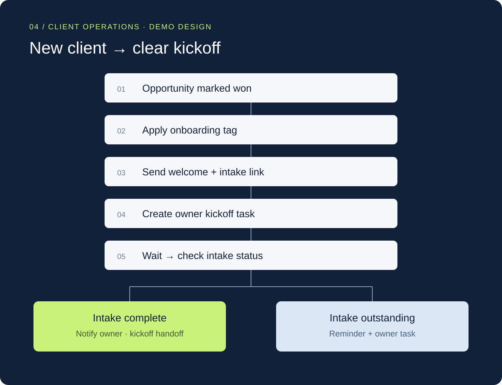
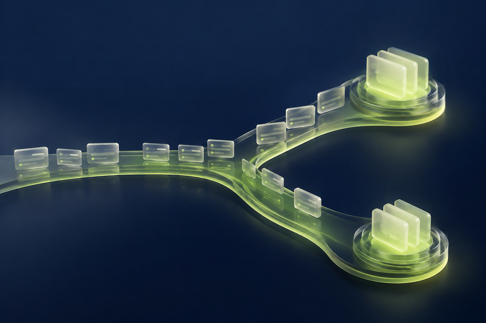

# GoHighLevel Workflow Portfolio

**Follow-up that responds. Appointments that stay organized. Onboarding with a clear next step.**

I build GoHighLevel workflows around customer journeys: the trigger, the timing, the decisions, and the handoff. Explore the collection below.

## Explore the work

| Project | Focus | Type |
| --- | --- | --- |
| [01 · Whitening offer](#whitening-offer) | SMS follow-up and positive-intent routing | GHL build |
| [02 · Lead follow-up](#lead-follow-up) | Enquiry capture and owner handoff | Demo design |
| [03 · Appointment journey](#appointment-journey) | Confirmations, reminders, and booking changes | Demo design |
| [04 · Client onboarding](#client-onboarding) | Welcome, intake, and kickoff preparation | Demo design |

## 01 · Whitening offer response workflow

**GHL build · Offer follow-up · SMS · Reply routing**

A whitening-offer sequence that changes the next message based on whether a contact responds and whether the response is positive.

- **Entry:** a contact tag starts the offer sequence.
- **Timing:** wait for a reply or a one-hour window.
- **Decision:** a reply moves to an intent check; no initial reply receives a second attempt.
- **Next step:** positive intent receives next-step messaging, with a separate SMS on the alternate branch.

[Explore the full build ↗](public/ghl-whitening-workflow.png)

## 02 · New lead → next conversation

**Demo design · Lead management · Opportunity tracking**

Designed to keep incoming enquiries organized and give the team a clear handoff. A new enquiry creates or updates the contact, assigns ownership, and receives an acknowledgement before the sequence checks for a reply or booking.

**Key decisions:** check consent, opt-out status, replies, and bookings before each follow-up. Prevent duplicate active entries. Notify the owner on reply and end nurture when the contact books.

**Validation plan:** test new and existing contacts, replies during a wait, and booking or opt-out before the next message.

## 03 · Booked → ready to attend

**Demo design · Appointment automation · Status-based reminders**

Designed to keep appointment information timely. The journey confirms the booking, waits until the reminder window, and checks the appointment status before sending.

**Key decisions:** use the appointment time and contact timezone. Skip elapsed reminder windows for short-notice bookings. Reschedules use the new appointment time; cancellations stop reminders.

**Validation plan:** test advance and short-notice bookings, a reschedule after confirmation, and a cancellation during the wait.

## 04 · New client → clear kickoff

**Demo design · Client operations · Intake and team tasks**

Designed to make the first steps after a sale clear. A won opportunity starts the welcome sequence, requests intake details, and creates an internal kickoff task.

**Key decisions:** prevent duplicate starts with an onboarding-in-progress tag. Check intake completion before sending reminders. Completed intake moves to the owner for kickoff; outstanding intake gets a reminder and task.

**Validation plan:** test repeated won-stage entry, early intake completion, and an outstanding intake form.

## The thinking behind the workflows

Every workflow starts with a clear entry point and ends with a defined next step. Timing, exceptions, and team ownership matter as much as the messages themselves.

The demo designs illustrate proposed workflow logic and are not deployed client projects. The featured whitening-offer workflow is the supplied GHL build.

---

**For businesses and hiring teams:** this collection focuses on GoHighLevel workflow logic, customer communication, and CRM handoffs.

[Development notes](docs/DEVELOPMENT.md)

